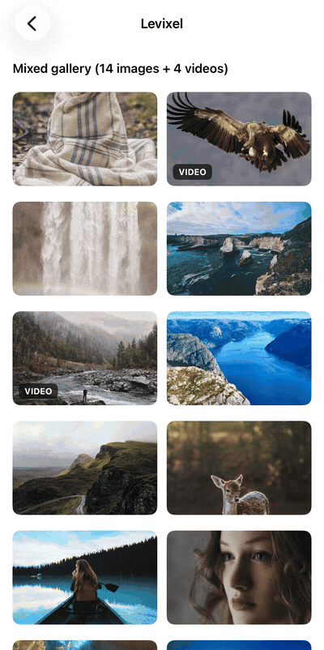

# Levixel

[中文](README.md)

Levixel is a native-feeling image and video viewer built around shared transitions, horizontal paging, pinch-to-zoom, zoomed panning, drag-to-dismiss, and video playback.

A shared transition starts from the visible source media's on-screen position, size, and corner radius, expands that content continuously into the full-screen viewer, and returns it to the corresponding source when dismissed. Even when the implementation hands off between a thumbnail, loading state, and original media, the user continues to perceive and manipulate one coherent piece of content.

<p align="center">
  
</p>

The interaction direction draws inspiration from the media-centered direct manipulation found in Google Photos and Apple's Photos app on iPhone. Those products are interaction references only; Levixel is not affiliated with, endorsed by, or based on their code. Levixel's own open-source lineage is documented under [License and provenance](#license-and-provenance).

## Capabilities

- Mixed image and video paging
- Source-anchored shared transitions for both opening and return
- Pinch zoom, zoomed panning, and double-tap reset
- Drag dismissal while the image is not zoomed, plus tap dismissal and system back handling
- Continuous handoff across thumbnails, loading states, original images, and video frames
- Published packages for Android, iOS, HarmonyOS, React Native, UniApp, and supported modern Web browsers

## Platforms and distribution

| Platform | Recommended channel | Integration |
| --- | --- | --- |
| Android | [Maven Central](https://central.sonatype.com/artifact/io.gitee.sandrox/levixel) · `io.gitee.sandrox:levixel` | Native AAR with an offline mirror on GitHub Releases |
| iOS | [Swift Package](https://github.com/sandroxy/levixel) | Binary XCFramework protected by checksum verification |
| HarmonyOS | [OHPM](https://ohpm.openharmony.cn/#/cn/detail/@sandrox%2Flevixel) · `@sandrox/levixel` | Native HAR with an offline mirror on GitHub Releases |
| React Native / Expo | [npm](https://www.npmjs.com/package/@sandrox/levixel) · `@sandrox/levixel` | React Native components with the required Android/iOS native runtimes included |
| UniApp | [DCloud Marketplace](https://ext.dcloud.net.cn/plugin?id=29394) | Classic uni-app and uni-app x Vapor Android/iOS Apps |
| Web | [npm](https://www.npmjs.com/package/@sandrox/levixel-web) · `@sandrox/levixel-web` | Framework-independent ESM browser runtime |

See [GitHub Releases](https://github.com/sandroxy/levixel/releases) and [CHANGELOG.md](CHANGELOG.md) for version history, checksums, and offline artifacts. Each package registry is the source of truth for the versions currently available through that channel; consult each platform guide for its exact capabilities and host requirements.

## Android

The minimum supported Android version is API 21.

Make Maven Central and JitPack available to dependency resolution:

```kotlin
dependencyResolutionManagement {
    repositories {
        google()
        mavenCentral()
        maven("https://jitpack.io")
    }
}
```

Use the latest stable version shown by Maven Central:

```kotlin
dependencies {
    implementation("io.gitee.sandrox:levixel:<version>")
}
```

The Android viewer uses PhotoView from JitPack for image zooming and panning, so the project must keep JitPack available.

Minimal viewer setup:

```java
LevixelMediaItem item = new LevixelMediaItem(
        "cover",
        LevixelMediaItem.MediaType.IMAGE,
        fullImageUrl,
        thumbnailUrl
);

List<LevixelMediaItem> items = Collections.singletonList(item);
LevixelSourceViewRegistry.register(
        LevixelSharedElementNames.forItem(item),
        sourceImageView
);

LevixelViewerOverlayView viewer = new LevixelViewerOverlayView(
        context,
        items,
        0,
        false,
        null,
        null
);
rootView.addView(viewer);
```

For complete system-bar transitions, use an edge-to-edge host and route system back events to `viewer.requestClose()`.

## iOS

The minimum supported iOS version is 13.0.

In Xcode, choose **File > Add Package Dependencies** and enter:

```text
https://github.com/sandroxy/levixel.git
```

Use **Up to Next Major Version** with the latest stable release shown on [GitHub Releases](https://github.com/sandroxy/levixel/releases) as the lower bound; Xcode will resolve compatible updates within that major version. Use **Exact Version** when the application must pin one release exactly. Then link the `Levixel` product to the app target.

```swift
import Levixel

let items: [LevixelMediaItem] = [
    .imageURL(fullImageURL, thumbnailURL: thumbnailURL, placeholder: imageView.image),
    .video(url: videoURL, poster: posterURL)
]

let dataSource = LevixelArrayDataSource(items: items)
imageView.setupLevixelViewer(
    dataSource: dataSource,
    initialIndex: 0,
    configuration: LevixelViewerConfiguration(theme: .dark),
    galleryId: "article-gallery"
)
```

For a multi-item list, configure every currently visible source `UIImageView` with the same `dataSource` and `galleryId`, using that source's own `initialIndex`. Call `removeLevixelViewerInteraction()` before a reusable cell is rebound to different content.

The Swift Package verifies the downloaded XCFramework against the checksum recorded in `Package.swift`.

## HarmonyOS

The minimum supported HarmonyOS version is API 23. The current HAR targets phone devices.

Install the currently published package from OHPM:

```sh
ohpm install @sandrox/levixel
```

The matching GitHub Release also provides the HAR and its SHA-256 file for offline or manual integration.

See the [HarmonyOS guide](native/harmonyos/levixel/README.md) for the component API and a complete example.

## React Native / Expo

```sh
pnpm add @sandrox/levixel
npx expo prebuild
```

The package includes the React Native integration and the required Android/iOS native runtimes, so the native core does not need to be integrated separately. See the [React Native adapter guide](adapters/react-native/README.md) for the component API and host requirements.

## UniApp

For new projects, install the plugin from the [DCloud Marketplace](https://ext.dcloud.net.cn/plugin?id=29394). The UTS plugin supports classic uni-app Vue 2 / Vue 3 App pages and uni-app x Vapor Android/iOS Apps; x VDOM is not supported. Both paths share one public JavaScript API and the same platform runtimes. `sourceVisibility` remains `visible` by default to prevent a last-frame source flash during WebView/Vapor close handoff.

See the [UniApp guide](uni_modules/Sandrox-Levixel/readme.md) for the complete compatibility boundary, loading-state integration, and examples. Matching GitHub Releases also provide the UTS ZIP and checksum for direct downloads and offline archives.

Classic uni-app Android/iOS projects that choose the App native-plugin workflow can use the separately published `levixel-uniapp-legacy-<version>.zip`. It uses the same-version public SDK, platform runtimes, and native cores, but it is not the DCloud UTS Marketplace package and does not support uni-app x.

## Web

```sh
pnpm add @sandrox/levixel-web
```

The Web package uses the browser DOM, Pointer Events, the Web Animations API, and native media elements for shared transitions, paging, zoom, pan, drag dismissal, and video controls. It defaults to `sourceVisibility: hidden` without changing UniApp's platform-specific `visible` default.

The verified browser matrix covers macOS Chrome, macOS Safari, Android Chrome, and iOS Safari. See the [Web guide](adapters/web/README.md) for the API, browser boundary, and accessibility behavior.

## Source and releases

```text
levixel/
├── native/          # Android, iOS, and HarmonyOS native cores
├── adapters/        # React Native, UniApp, and Web adapters
├── uni_modules/     # DCloud Marketplace UTS plugin source
├── contract/        # Cross-platform public contract
├── packaging/       # Platform artifact templates
├── scripts/         # Build, artifact inspection, and release tools
├── schema/          # Plugin manifest schema
└── plugin.yaml      # Machine-readable version, capability, and delivery manifest
```

See [DEVELOPMENT.md](DEVELOPMENT.md) for local builds, tests, and SDK prerequisites. See [RELEASING.md](RELEASING.md) for signing and channel-publication procedures.

## License and provenance

Levixel is released under the MIT License and contains traceable MIT-licensed derivative work. Source lineage, license terms, and retained notices are documented in [PROVENANCE.md](PROVENANCE.md), [LICENSE](LICENSE), and [THIRD_PARTY_NOTICES.md](THIRD_PARTY_NOTICES.md).
